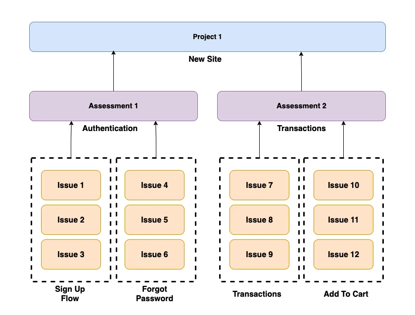

# A11y Logger

**Free, offline-first accessibility program management tool.**

A11y Logger is an open-source tool for accessibility consultants and program managers. Audit, report, and produce standards-compliant output without the fuss of signing contracts, sales demos, or paying per seat.


<!-- Screenshot: the main dashboard with a project open, showing the sidebar navigation, a list of assessments, and the progress summary card -->

---

## Why this exists

Most accessibility management tools require expensive subscriptions/contracts, upselling sales demos, or have workflows that are just tied exclusively to that platform. A11y Logger is the tool I wanted to use myself, so it's built by an accessibility specialist around actual SME workflows.

---

## What you can do with it

### Log Issues

Log an a11y violation with its WCAG code, severity, affected URL, environment, and screenshots or videos. Each issue links directly to the relevant VPAT criteria rows.

For faster workflow, describe an issue to the AI and let it draft the issue for you to edit as you see fit.


<!-- Screenshot: the issues list for an assessment, showing several issues with WCAG codes (e.g. 1.4.3, 2.4.7), severity badges, and a filter bar -->

### Organize Assessments

Log issues and group them into assessments. Each assessment can be a scope of work, such as a product, a sprint, or a client engagement. Assessments are grouped into projects. This gives you a flexible system to organize your work.



### Generate Reports

Create reports with an executive summary, severity breakdown, and WCAG criteria analysis. AI can draft the narrative sections if you bring your own API key, or you can write them yourself. These reports can be exported in a variety of formats.

| Export format      | Description                                                                                 |
| ------------------ | ------------------------------------------------------------------------------------------- |
| HTML               | Just the report sections you add in an HTML file with styles and JS for interactive viewing |
| HTML - With Charts | Same as above but with visualizations.                                                      |
| HTML - With Issues | The sections you add, visualizations, and a list of issues.                                 |
| HTML - All         | Export everything for a full, comprehensive report.                                         |
| Word (.docx)       | Word compatible document                                                                    |

<br />
<br />


<!-- Screenshot: a report detail page showing the executive summary field, a bar chart or table of issues by severity, and the WCAG criteria counts section -->

### Create VPATs

Build VPATs against WCAG 2.1, WCAG 2.2, Section 508, or EN 301 549. The editor organizes criteria into per-section tabs (Level A/AA/AAA, Functional Performance Criteria, Software, Documentation, etc.) and includes a cover sheet for product and vendor details.

If you use the AI feature, criteria rows populate from your issues. If your product has multiple scopes such as a web app and a downloadable document, you can track separate conformance ratings and remarks per component within a single VPAT row.

AI can write conformance narratives and explain its rationale. An optional AI Review Pass runs a second check on each generated row to validate the conformance rating against the evidence. VPATs require human review before publishing. VPATs can also be exported in several formats.

| Export format | Description                                                                                                              |
| ------------- | ------------------------------------------------------------------------------------------------------------------------ |
| HTML          | VPAT in HTML format                                                                                                      |
| Word (.docx)  | Standard VPAT table format for client delivery                                                                           |
| OpenACR YAML  | Machine-readable format for the [GSA ACR Editor](https://acreditor.section508.gov/)                                      |
| PDF           | Browser print-to-PDF. Note: browser-generated PDFs are untagged. The UI prompts you to use DOCX for accessible delivery. |

<br />
<br />


<!-- Screenshot: the VPAT criteria table with several rows visible, showing the conformance level dropdown (Supports, Partially Supports, etc.) and a remarks text field -->

---

## AI features (optional)

A11y Logger works without AI. If you want help drafting report narratives or VPAT conformance notes, bring your own API key. Configure it once in Settings (or a `.env`) and use it across all projects.

You can assign a different model to each task type: issue analysis, VPAT generation, report writing, and the AI Review Pass. Leave a task model blank and it falls back to the provider default.

Supported providers:

- **OpenAI**
- **Anthropic**
- **Gemini**
- **Ollama** (local — no data leaves your machine)

---

## Language support

The UI is available in English, French, Spanish, and German. Switch languages from the header.

**Criteria translation coverage:**

| Standard                         | French (fr)                                           | Spanish (es)                                            | German (de)                                           |
| -------------------------------- | ----------------------------------------------------- | ------------------------------------------------------- | ----------------------------------------------------- |
| WCAG (all criteria)              | Full — official W3C French translation                | Full — official W3C Spanish translation                 | English fallback — no official W3C German translation |
| EN 301 549 (Clauses 4–8, 12, 13) | Full — official ETSI French publication               | English fallback — no official ETSI Spanish translation | Full — official ETSI German publication               |
| EN 301 549 (Clauses 10, 11)      | English fallback                                      | English fallback                                        | English fallback                                      |
| Section 508                      | English fallback — US regulation, English-only source | English fallback                                        | English fallback                                      |

"English fallback" means the criterion name displays in English when no official translation is available.

---

## Team use

A11y Logger is single-user by default. If you're running a shared install, enable optional local authentication in Settings. You can create user accounts and require login without any cloud dependency. Be careful though because forgot password support is not yet implemented.

---

## Getting started

**Prerequisites:** Node.js 20+

```bash
git clone https://github.com/hci-design-lab/a11y-logger.git
cd a11y-logger
npm install
npm run dev
```

Open [http://localhost:3000](http://localhost:3000). Data is stored in `./data/` — a SQLite database and a local media directory. Nothing is sent anywhere.

---

## API Documentation

Interactive API documentation is available at [`/api-docs`](http://localhost:3000/api-docs) when the app is running. The raw OpenAPI 3.0 spec is served at `/api/openapi.json`.

---

## Contributing

A11y Logger is open source under AGPL-3.0. Bug fixes, features, documentation, and accessibility improvements to the tool itself are all welcome.

See [CONTRIBUTING.md](CONTRIBUTING.md) for setup instructions, project structure, and how to submit a PR.

---

## License

[AGPL-3.0](LICENSE) — free to use and modify. If you build a hosted service on top of A11y Logger, the AGPL requires you to open-source your modifications. For commercial licensing inquiries, send an email to [hello@hcidesignlab.com](mailto:hello@hcidesignlab.com).
