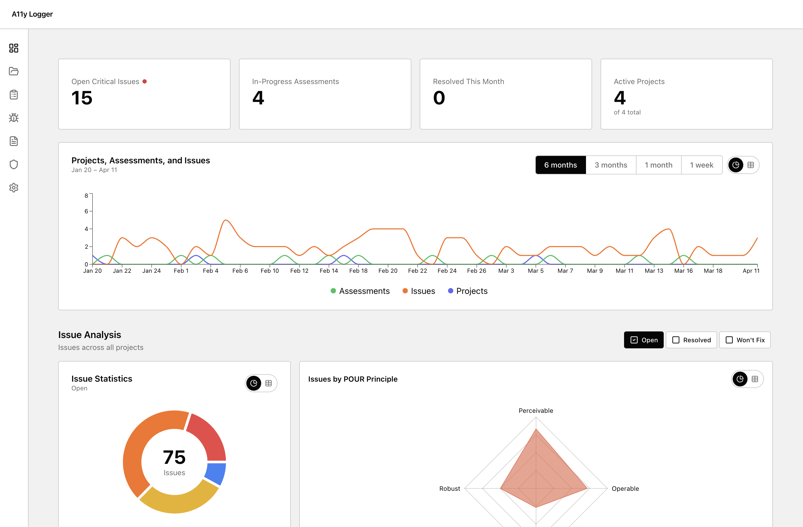

# A11y Logger

**Free, offline-first accessibility auditing. No accounts. No cloud. Just your work.**

A11y Logger is an open-source tool for accessibility consultants and in-house teams who want a structured workflow for auditing, reporting, and producing standards-compliant output — without giving their data to a SaaS platform or paying per seat.



<!-- Screenshot: the main dashboard with a project open, showing the sidebar navigation, a list of assessments, and the progress summary card -->

---

## Why this exists

Most accessibility audit tools are either expensive subscriptions, require cloud accounts, or produce output that doesn't map cleanly to WCAG criteria and VPAT formats. A11y Logger is the tool we wanted to use ourselves — local-first, offline-capable, and built around the actual deliverables practitioners produce.

---

## What you can do with it

### Log Issues

Document findings with WCAG criterion codes, severity levels, environment details, affected URLs, and screenshot evidence. Issues link directly to VPAT criteria rows.


<!-- Screenshot: the issues list for an assessment, showing several issues with WCAG codes (e.g. 1.4.3, 2.4.7), severity badges, and a filter bar -->

### Organize Assessments

Group issues into assessments within projects. Each assessment represents a scope of work — a product, a sprint, a client engagement.

### Generate Reports

Create structured reports with executive summaries, severity breakdowns, and WCAG criteria analysis. Optional AI assistance (BYOK) can draft narrative sections — or work entirely manually.


<!-- Screenshot: a report detail page showing the executive summary field, a bar chart or table of issues by severity, and the WCAG criteria counts section -->

### Create VPATs

Build Voluntary Product Accessibility Templates against WCAG 2.1, WCAG 2.2, Section 508, or EN 301 549. Criteria rows are auto-populated and linked to your issues. AI can generate conformance narratives from your issue data.


<!-- Screenshot: the VPAT criteria table with several rows visible, showing the conformance level dropdown (Supports, Partially Supports, etc.) and a remarks text field -->

---

## Export formats

| Format       | Use case                                                                            |
| ------------ | ----------------------------------------------------------------------------------- |
| HTML         | Printable via browser — File → Print → Save as PDF                                  |
| Word (.docx) | Standard VPAT and report format for client delivery                                 |
| OpenACR YAML | Machine-readable format for the [GSA ACR Editor](https://acreditor.section508.gov/) |

---

## AI features (optional)

A11y Logger works fully without AI. If you want AI-assisted report narratives and VPAT conformance notes, bring your own API key — no data leaves your machine through A11y Logger itself.

Supported providers: **OpenAI**, **Anthropic**, **Ollama** (local), **Gemini**

Configure your key in Settings once and use it across all projects.

---

## Getting started

**Prerequisites:** Node.js 20+

```bash
git clone https://github.com/YOUR_ORG/a11y-pm.git
cd a11y-pm
npm install
npm run dev
```

Open [http://localhost:3000](http://localhost:3000). Data is stored in `./data/` — a SQLite database and a local media directory. Nothing is sent anywhere.

---

## Contributing

A11y Logger is open source under AGPL-3.0. Contributions are welcome — bug fixes, features, documentation, and accessibility improvements to the tool itself.

See [CONTRIBUTING.md](CONTRIBUTING.md) for setup instructions, project structure, and how to submit a PR.

---

## License

[AGPL-3.0](LICENSE) — free to use and modify. If you build a hosted service on top of A11y Logger, the AGPL requires you to open-source your modifications. For commercial licensing inquiries, open an issue.
