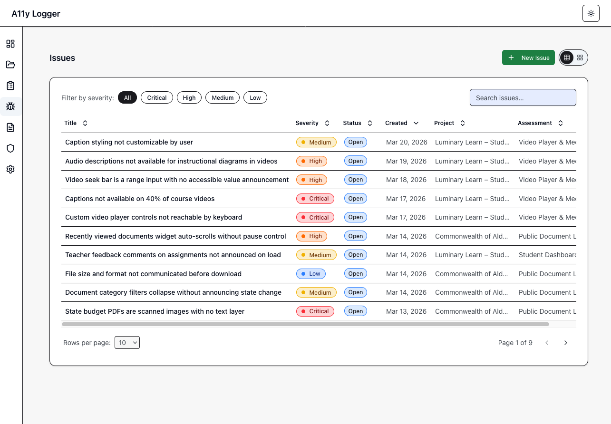
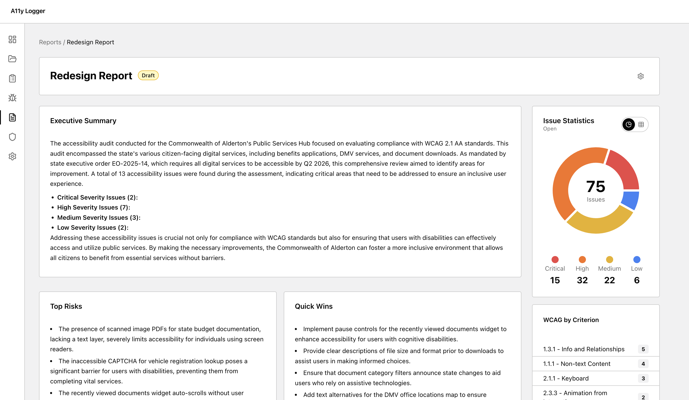
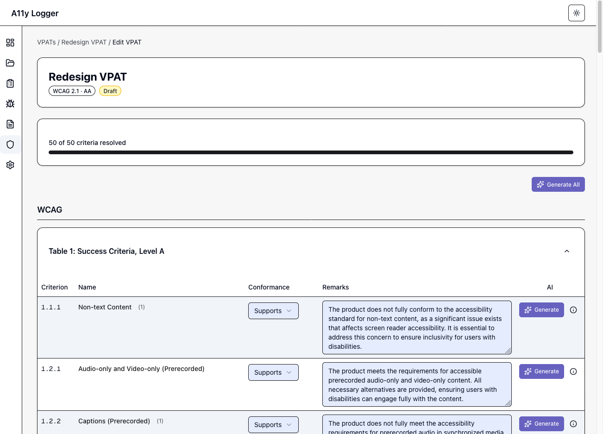

# A11y Logger

**Free, offline-first accessibility program management tool.**

A11y Logger is an open-source tool for accessibility consultants and program managers. Audit, report, and produce standards-compliant output without the fuss of signing contracts, sales demos, or paying per seat.


<!-- Screenshot: the main dashboard with a project open, showing the sidebar navigation, a list of assessments, and the progress summary card -->

---

## Why this exists

Most accessibility management tools require expensive subscriptions/contracts, upselling sales demos, or have workflows that are just tied exclusively to that platform. A11y Logger is the tool we wanted to use ourselves, built by accessibility specialists around actual SME workflows.

---

## What you can do with it

### Log Issues

Log a finding with its WCAG code, severity, affected URL, environment, and screenshots or videos. Each issue links directly to the relevant VPAT criteria rows.

Or describe an issue to the AI and let it draft the issue for you to edit as you see fit.



<!-- Screenshot: the issues list for an assessment, showing several issues with WCAG codes (e.g. 1.4.3, 2.4.7), severity badges, and a filter bar -->

### Organize Assessments

Log issues and group them into assessments. Each assessment can be a scope of work, such as a product, a sprint, or a client engagement. Assessments are grouped into projects. This gives you a flexible system to organize your work.

### Generate Reports

Create reports with an executive summary, severity breakdown, and WCAG criteria analysis. AI can draft the narrative sections if you bring your own API key, or you can write them yourself.

| Export format      | Description                                                                                 |
| ------------------ | ------------------------------------------------------------------------------------------- |
| HTML               | Just the report sections you add in an HTML file with styles and JS for interactive viewing |
| HTML - With Charts | Same as above but with visualizations.                                                      |
| HTML - With Issues | The sections you add, visualizations, and a list of issues.                                 |
| HTML - All         | Export everything for a full, comprehensive report.                                         |
| Word (.docx)       | Word compatible document                                                                    |

<br />
<br />


<!-- Screenshot: a report detail page showing the executive summary field, a bar chart or table of issues by severity, and the WCAG criteria counts section -->

### Create VPATs

Build VPATs against WCAG 2.1, WCAG 2.2, Section 508, or EN 301 549. Criteria rows populate from your issues. AI can write the conformance narratives and explain its rationale. VPATs require human review before publishing.

| Export format | Description                                                                         |
| ------------- | ----------------------------------------------------------------------------------- |
| HTML          | VPAT in HTML format                                                                 |
| Word (.docx)  | Standard VPAT table format for client delivery                                      |
| OpenACR YAML  | Machine-readable format for the [GSA ACR Editor](https://acreditor.section508.gov/) |

<br />
<br />



<!-- Screenshot: the VPAT criteria table with several rows visible, showing the conformance level dropdown (Supports, Partially Supports, etc.) and a remarks text field -->

---

## AI features (optional)

A11y Logger works without AI. If you want help drafting report narratives or VPAT conformance notes, bring your own API key. You can use it as much or as little as you want. Configure your key in Settings or a .env once and use it across all projects.

Supported providers:

- **OpenAI**
- **Anthropic**
- **Gemini**
- **Ollama** (local — no data leaves your machine)

---

## Getting started

**Prerequisites:** Node.js 20+

```bash
git clone https://github.com/hci-design-lab/a11y-logger.git
cd a11y-logger
npm install
npm run dev
```

Open [http://localhost:3000](http://localhost:3000). Data is stored in `./data/` — a SQLite database and a local media directory. Nothing is sent anywhere.

---

## Contributing

A11y Logger is open source under AGPL-3.0. Bug fixes, features, documentation, and accessibility improvements to the tool itself are all welcome.

See [CONTRIBUTING.md](CONTRIBUTING.md) for setup instructions, project structure, and how to submit a PR.

---

## License

[AGPL-3.0](LICENSE) — free to use and modify. If you build a hosted service on top of A11y Logger, the AGPL requires you to open-source your modifications. For commercial licensing inquiries, send an email to [hello@hcidesignlab.com](mailto:hello@hcidesignlab.com).
